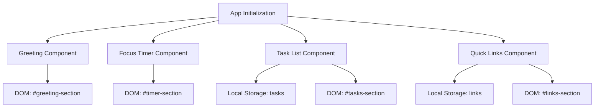

# Design Document: Productivity Dashboard

## Overview

The Productivity Dashboard is a client-side web application built with vanilla HTML, CSS, and JavaScript. The architecture follows a component-based approach where each major feature (Greeting, Focus Timer, To-Do List, Quick Links) is implemented as a self-contained module with its own state management and DOM manipulation logic.

The application uses the browser's Local Storage API as its persistence layer, storing all user data (tasks and links) as JSON-serialized objects. The single-file architecture constraint means all JavaScript logic resides in one file, organized into logical sections using the module pattern or object-oriented approach.

Key design principles:
- **Separation of concerns**: Each component manages its own state, DOM elements, and event handlers
- **Data-driven rendering**: UI updates are triggered by state changes, not direct DOM manipulation
- **Persistence transparency**: Components automatically sync with Local Storage on every state change
- **No external dependencies**: Pure vanilla JavaScript with no frameworks or libraries

## Architecture

### High-Level Structure

```
productivity-dashboard/
├── index.html          # Single HTML entry point
├── css/
│   └── styles.css      # All application styles
└── js/
    └── app.js          # All application logic
```

### Component Architecture

The application follows a modular component pattern where each component is responsible for:
1. **State Management**: Maintaining its own internal state
2. **Rendering**: Creating and updating its DOM representation
3. **Event Handling**: Responding to user interactions
4. **Persistence**: Syncing state with Local Storage



### Application Flow

1. **Initialization Phase**:
   - DOM content loaded event fires
   - Each component initializes and loads data from Local Storage
   - Initial render of all components
   - Event listeners attached

2. **Runtime Phase**:
   - Greeting component updates every second via setInterval
   - Timer component updates every second when active
   - User interactions trigger component methods
   - State changes trigger re-renders and Local Storage updates

3. **Persistence Phase**:
   - Every state mutation immediately writes to Local Storage
   - No explicit "save" action required from user
   - Data survives page reloads and browser restarts

## Components and Interfaces

### 1. Greeting Component

**Responsibilities**:
- Display current time in 12-hour format with AM/PM
- Display current date (day of week, month, day)
- Display time-based greeting message
- Update display every second

**Interface**:
```javascript
class GreetingComponent {
  constructor(containerElement)
  init()
  updateDisplay()
  getGreeting(hour)
  formatTime(date)
  formatDate(date)
  destroy()
}
```

**State**: None (stateless, derives all data from current Date)

**DOM Structure**:
```html
<div id="greeting-section">
  <div class="greeting-message">Good morning</div>
  <div class="current-time">10:30 AM</div>
  <div class="current-date">Monday, January 15</div>
</div>
```

### 2. Focus Timer Component

**Responsibilities**:
- Manage 25-minute countdown timer
- Provide start, stop, and reset controls
- Update display every second when running
- Display time in MM:SS format

**Interface**:
```javascript
class FocusTimerComponent {
  constructor(containerElement)
  init()
  start()
  stop()
  reset()
  tick()
  formatTime(seconds)
  render()
  destroy()
}
```

**State**:
```javascript
{
  totalSeconds: 1500,      // 25 minutes in seconds
  remainingSeconds: 1500,
  isRunning: false,
  intervalId: null
}
```

**DOM Structure**:
```html
<div id="timer-section">
  <div class="timer-display">25:00</div>
  <div class="timer-controls">
    <button id="timer-start">Start</button>
    <button id="timer-stop">Stop</button>
    <button id="timer-reset">Reset</button>
  </div>
</div>
```

### 3. Task List Component

**Responsibilities**:
- Display list of tasks with completion status
- Add new tasks
- Edit existing tasks
- Delete tasks
- Toggle task completion status
- Persist all changes to Local Storage

**Interface**:
```javascript
class TaskListComponent {
  constructor(containerElement, storageKey)
  init()
  loadTasks()
  saveTasks()
  addTask(text)
  editTask(id, newText)
  deleteTask(id)
  toggleTask(id)
  render()
  renderTask(task)
  destroy()
}
```

**State**:
```javascript
{
  tasks: [
    { id: string, text: string, completed: boolean, createdAt: number }
  ]
}
```

**DOM Structure**:
```html
<div id="tasks-section">
  <div class="task-input-container">
    <input type="text" id="task-input" placeholder="Add a new task...">
    <button id="task-add">Add</button>
  </div>
  <ul class="task-list">
    <li class="task-item" data-task-id="123">
      <input type="checkbox" class="task-checkbox">
      <span class="task-text">Sample task</span>
      <button class="task-edit">Edit</button>
      <button class="task-delete">Delete</button>
    </li>
  </ul>
</div>
```

### 4. Quick Links Component

**Responsibilities**:
- Display list of saved links
- Add new links with name and URL
- Edit existing links
- Delete links
- Open links in new tab
- Persist all changes to Local Storage

**Interface**:
```javascript
class QuickLinksComponent {
  constructor(containerElement, storageKey)
  init()
  loadLinks()
  saveLinks()
  addLink(name, url)
  editLink(id, newName, newUrl)
  deleteLink(id)
  render()
  renderLink(link)
  destroy()
}
```

**State**:
```javascript
{
  links: [
    { id: string, name: string, url: string, createdAt: number }
  ]
}
```

**DOM Structure**:
```html
<div id="links-section">
  <div class="link-input-container">
    <input type="text" id="link-name" placeholder="Link name">
    <input type="url" id="link-url" placeholder="https://example.com">
    <button id="link-add">Add</button>
  </div>
  <ul class="link-list">
    <li class="link-item" data-link-id="456">
      <a href="https://example.com" target="_blank" class="link-anchor">Example</a>
      <button class="link-edit">Edit</button>
      <button class="link-delete">Delete</button>
    </li>
  </ul>
</div>
```

### 5. Application Controller

**Responsibilities**:
- Initialize all components on page load
- Coordinate component lifecycle
- Handle global error scenarios

**Interface**:
```javascript
class App {
  constructor()
  init()
  initializeComponents()
  destroy()
}
```

## Data Models

### Task Model

```javascript
{
  id: string,           // UUID or timestamp-based unique identifier
  text: string,         // Task description (1-500 characters)
  completed: boolean,   // Completion status
  createdAt: number     // Unix timestamp in milliseconds
}
```

**Validation Rules**:
- `id`: Must be unique, non-empty string
- `text`: Must be non-empty after trimming, max 500 characters
- `completed`: Must be boolean
- `createdAt`: Must be positive number

### Link Model

```javascript
{
  id: string,           // UUID or timestamp-based unique identifier
  name: string,         // Display name for the link (1-100 characters)
  url: string,          // Valid URL starting with http:// or https://
  createdAt: number     // Unix timestamp in milliseconds
}
```

**Validation Rules**:
- `id`: Must be unique, non-empty string
- `name`: Must be non-empty after trimming, max 100 characters
- `url`: Must be valid URL format (http:// or https://)
- `createdAt`: Must be positive number

### Local Storage Schema

**Storage Keys**:
- `productivity-dashboard-tasks`: Array of Task objects
- `productivity-dashboard-links`: Array of Link objects

**Storage Format**:
```javascript
// localStorage.getItem('productivity-dashboard-tasks')
'[{"id":"1234","text":"Complete project","completed":false,"createdAt":1704067200000}]'

// localStorage.getItem('productivity-dashboard-links')
'[{"id":"5678","name":"GitHub","url":"https://github.com","createdAt":1704067200000}]'
```

**Storage Operations**:
- Read: `JSON.parse(localStorage.getItem(key) || '[]')`
- Write: `localStorage.setItem(key, JSON.stringify(data))`
- Clear: `localStorage.removeItem(key)`

**Error Handling**:
- Catch JSON parse errors and default to empty array
- Handle quota exceeded errors (Local Storage full)
- Validate data structure after parsing

